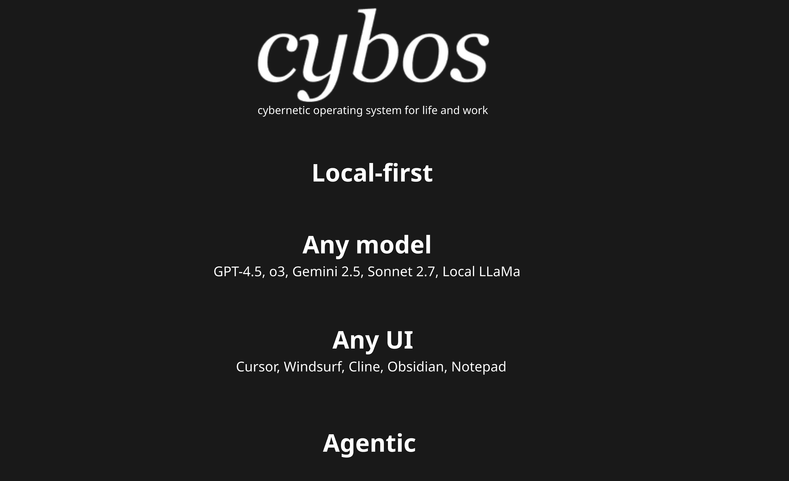

# CybOS

CybOS is a local-first, extensible knowledge and automation operating system built for Cursor. It enables users to build personalized workflows, task automations, and domain-specific copilots using a structured folder system of data, rules, and scripts.

Local-first AI stack that turns Markdown, git and natural-language rules into a personal chief-of-staff:

- Store every note, deal and project beside the code that automates it
- Run offline, keep keys local
- Swap models on the fly: GPT-4.1, o3, Gemini 2.5, Claude, Mixtral or llama.cpp
- Use any editor—Cursor, Obsidian, Notepad, whatever opens text
- Pipe tasks through built-in connectors for Gmail, Telegram, Asana, Notion or any API you wire in one prompt

# Requirements

- Python3
- Cursor account

# Installation

1. Install [Cursor](https://cursor.sh) and, optionally, [Obsidian](https://obsidian.md)
2. Clone and open cybOS folder — you're all set!
   
3. (Optional) If you want to use automations, you will need to install Python 3
4. (Optional) Install dependencies using requirements.txt
5. (Optional) Rename .env.example to .env and add your API keys
6. (Optional) If you want Gmail connection, download client_secret.json from https://console.cloud.google.com and paste it into .env
